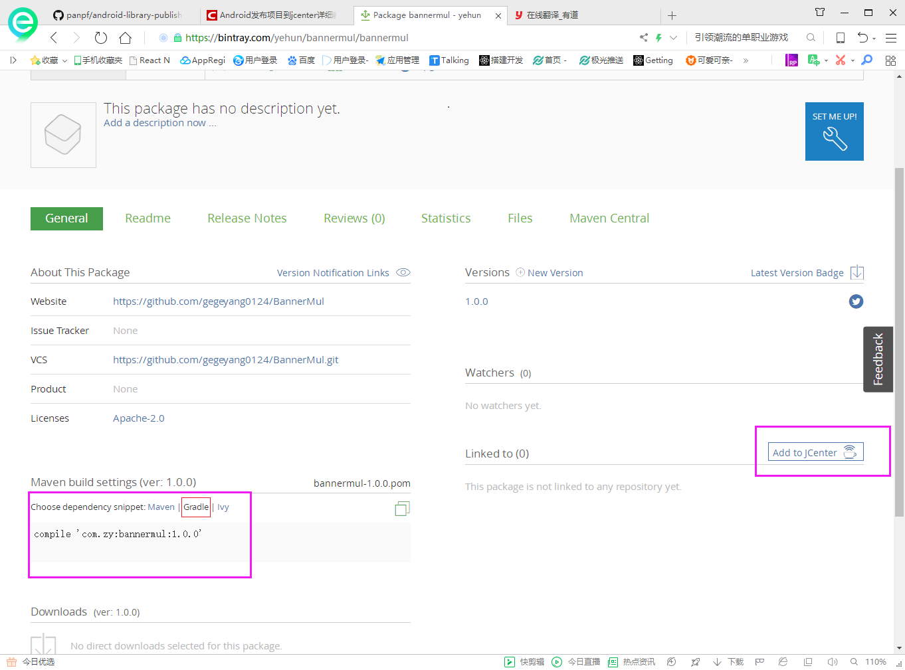

# android-library-publish-to-jcenter
这是个例子，将Android library打包成aar发布到jcenter的项目 (This is a help Android developer to AAR jcenter project released)

### 1. 注册 Bintray 账号 ([传送门](https://bintray.com))

Bintray 是 jcenter 的托管商，因此你必须注册一个 Bintray 账号，注册完账号后记下你的用户名以及 API Key。

登陆后在首页右上角点击用户名进入个人主页，然后点击用户名下面的 Edit 进入个人信息编辑页面，接下来点击页面左边列表的最后一项 API Key


如图所示点击最右边箭头指示的复制按钮即可复制你的 API Key

### 2.创建Android library


### 3. 配置插件

首先升级 Android 插件到最新版，然后添加 maven 插件 bintray 插件，完成后如下：

```groovy
buildscript {
    repositories {
        jcenter()
    }
    dependencies {
        classpath 'com.android.tools.build:gradle:3.0.0'
        classpath 'com.github.dcendents:android-maven-gradle-plugin:1.5'
        classpath 'com.jfrog.bintray.gradle:gradle-bintray-plugin:1.7.3'
        // NOTE: Do not place your application dependencies here; they belong
        // in the individual module build.gradle files
    }
}

allprojects {
    repositories {
        jcenter()
    }
}
```

>* android-maven-gradle-plugin 插件是用来打包 Maven 所需文件的
>* gradle-bintray-plugin 插件是用来将生成的 Maven 所需文件上传到 Bintray 的

### 4. 配置项目信息

下载 [gradle.properties](./LibToJcenter/gradle.properties) 文件并放到你的 library module 目录下

project.properties 文件的原始内容如下：

```properties
#project
project.name=
project.groupId=
project.artifactId=
project.packaging=aar
project.siteUrl=
project.gitUrl=

#javadoc
javadoc.name=
```

详解：
>* project.name：项目名称
>* project.groupId：项目组ID，通常情况下如果你的包名为 com.example.test，那么项目组 ID 就是 com.example
>* project.artifactId：项目ID，通常情况下如果你的包名为 com.example.test，那么项目 ID 就是 test
>* project.packaging：包类型，Android 库是 aar
>* project.siteUrl：项目官方网站的地址，没有的话就用 Github 上的地址，例如：https://github.com/xiaopansky/Sketch
>* project.gitUrl：项目的 Git 地址，例如：https://github.com/xiaopansky/Sketch.git
>* javadoc.name：生成的 javadoc 打开后主页显示的名称，通常跟项目名称一样即可

完成配置后如下所示：

```properties
#project
project.name=bannermul
project.groupId=com.zy
project.artifactId=bannermul
project.packaging=aar
project.siteUrl=https://github.com/gegeyang0124/BannerMul
project.gitUrl=https://github.com/gegeyang0124/BannerMul.git

#javadoc
javadoc.name=bannermul
```

你无需配置项目版本，会自动从你的 build.gradle 中获取版本名称作为项目版本

### 5. 配置Bintray账号以及开发者信息


下载 [local.properties](./LibToJcenter/local.properties) 文件并放到你的 library module 目录下

local.properties 文件的原始内容如下：
```properties
#bintray
bintray.user=
bintray.apikey=

#developer
developer.id=
developer.name=
developer.email=
```

详解：
>* bintray.user：你的 Bintray 的用户名
>* bintray.apikey：你的的 Bintray 的 API Key
>* developer.id：通常是你在开源社区的昵称
>* developer.name：你的姓名
>* developer.email：你的邮箱

完成配置后如下所示：

```properties
#bintray
bintray.user=xiaopansky
#bintray.apikey=你的bintray的key

developer.id=gegeyang0124
developer.name=zhouyang
developer.email=584450903@qq.com
```

*号显示的为个人信息不反方便透露，还请见谅

注意要将 local.proerties 文件加入忽略列表，以免被提交到 Github 或其他网站泄露个人信息

### 6. 配置 bintrayUpload.gradle

#### 方法1：直接使用远程 bintrayUpload.gradle 文件

修改你的 library module 的 build.gradle 文件，在最后加上 ``apply from: "https://raw.githubusercontent.com/panpf/android-library-publish-to-jcenter/master/bintrayUpload.gradle"`` ，如下所示：

```groovy
apply plugin: 'com.android.library'

android {
    compileSdkVersion 27

    defaultConfig {
        minSdkVersion 15
        targetSdkVersion 27
        versionCode 1
        versionName "1.0"

        testInstrumentationRunner "android.support.test.runner.AndroidJUnitRunner"

    }

    buildTypes {
        release {
            minifyEnabled false
            proguardFiles getDefaultProguardFile('proguard-android.txt'), 'proguard-rules.pro'
        }
    }

}

dependencies {
    implementation fileTree(dir: 'libs', include: ['*.jar'])

    implementation 'com.android.support:appcompat-v7:27.1.1'
    testImplementation 'junit:junit:4.12'
    androidTestImplementation 'com.android.support.test:runner:1.0.2'
    androidTestImplementation 'com.android.support.test.espresso:espresso-core:3.0.2'
}


apply from: "https://github.com/gegeyang0124/android-library-publish-to-jcenter/blob/master/LibToJcenter/testlib/bintrayUpload.gradle"
```

#### 方法2：下载后使用本地 bintrayUpload.gradle 文件


首先下载 [bintrayUpload.gradle](./LibToJcenter/testlib/bintrayUpload.gradle) 文件并放到你的 library module 目录下

然后修改你的 library module 的 build.gradle 文件，在最后加上 `apply from: "bintrayUpload.gradle"` ，如下所示：

```groovy
apply plugin: 'com.android.library'

android {
    compileSdkVersion 27

    defaultConfig {
        minSdkVersion 15
        targetSdkVersion 27
        versionCode 1
        versionName "1.0"

        testInstrumentationRunner "android.support.test.runner.AndroidJUnitRunner"

    }

    buildTypes {
        release {
            minifyEnabled false
            proguardFiles getDefaultProguardFile('proguard-android.txt'), 'proguard-rules.pro'
        }
    }

}

dependencies {
    implementation fileTree(dir: 'libs', include: ['*.jar'])

    implementation 'com.android.support:appcompat-v7:27.1.1'
    testImplementation 'junit:junit:4.12'
    androidTestImplementation 'com.android.support.test:runner:1.0.2'
    androidTestImplementation 'com.android.support.test.espresso:espresso-core:3.0.2'
}

apply from: "bintrayUpload.gradle"
```

推荐大家使用第一种方案，简单快捷，至此配置工作已全部结束

### 7. 执行命令打包并上传到 Bintray

打开终端进入项目目录下，执行 'gradlew install',然后再执行 `gradlew clean build bintrayUpload` 命令即可

`千万不要在 Android Studio 的 Gradle 窗口中选择 "Run *** bintrayUpload" 执行，这样你会得到 build/libs/***-javadoc.jar could not be found. build/libs/***-sources.jar could not be found. poms/pom-default.xml (No such file or directory) 错误`

另外，如果你的本地已经配置了 Gradle 了，那么执行 `gradle bintrayUpload` 命令也可以。 gradlew 是 Gradle 的一层封装，如果你本地没有安装 Gradle gradlew 就会自动下载 Gradle

### 8. [请求提交你的项目到 jcenter](https://blog.csdn.net/yufumatou/article/details/80376788?tdsourcetag=s_pcqq_aiomsg)


前面所有步骤走完之后实际上只是上传了你的项目到 Bintray 而已，并没有被包含在 jcenter 中，要想提交到 jcenter 中还需要 Bintray 的审核。

登入 Bintray 网站，进入个人中心，在右侧的 Owned Repositories 区域点击 Maven 的图标，进入你的 Maven 项目列表。

如果已经上传成功了，在这里就能看到你的项目，进入项目详情，在右下角的 Linked To 区域点击 Add to JCenter ，然后在 Comments 输入框里随便填写下信息，最后点 Send 提交请求即可

一般情况下审核需要 4 到 5 个小时，耐心等待就行了，审核通过后会给你发邮件通知你，并且以后更新项目就不需要再审核了。

### 9. 一句话导入你的项目

当审核通过后，别人就可以一句话导入你的项目了，例如：

```groovy
compile 'com.zy:bannermul:1.0.0'
```

### 10. 额外补充：

保持你的 library module 的名字同 artifactId 一样
因为在 Bintray 上你的项目的 maven-metadata.xml 文件的路径是 `gruopId+"/"+module名称`

例如你的 groupId 是 com.example，artifactId 是 test，但 module 名称是 library

这时候项目文件是在 com.example.test 目录下的，但 maven-metadata.xml 文件却是在 com.example.library 目录下的

这样一来如果你有多个项目 groupId 一样，artifactId 不一样，但 module 名称都是 library 的话，可能就会冲突

目前为止我还没有找到更好的解决办法，就只能让 module 名称和 artifactId 保持一致，如果你们谁有更好的办法，欢迎留言交流

### 11. 参考文章
>* [Android使用Gradlew发布aar项目到JCenter仓库](https://github.com/panpf/android-library-publish-to-jcenter)
>* [Android拓展系列(12)--使用Gradle发布aar项目到JCenter仓库](http://www.cnblogs.com/qianxudetianxia/p/4322331.html)
>* [使用Gradle发布Android开源项目到JCenter](http://blog.csdn.net/maosidiaoxian/article/details/43148643)
>* [Android 项目打包到 JCenter 的坑](http://www.jianshu.com/p/c721f9297b2f?utm_campaign=hugo&utm_medium=reader_share&utm_content=note)

### 12. 常见问题
>* `Error:Cause: org/gradle/api/publication/maven/internal/DefaultMavenFactory`：当你使用的 Gradle 版本是 2.4 以上，Android 插件版本是 1.3.0 以上的时候就会出现这个问题，这时候你只需将 android-maven-gradle-plugin 插件版本改为 **classpath 'com.github.dcendents:android-maven-gradle-plugin:1.3'** 即可
>* `You are using JDK version ‘java version “1.7.0_71”’. Some versions of JDK 1.7 (e.g. 1.7.0_10) may cause class loading errors in Gradle.Please update to a newer version (e.g. 1.7.0_67)`：当你使用的 Gradle 版本是 2.4 以上，Andriod 插件版本是 1.2.3 的时候就会出现这个问题，同样的你只需要将 android-maven-gradle-plugin 插件版本改为 **classpath 'com.github.dcendents:android-maven-gradle-plugin:1.3'** 即可
>* `No value has been specified for property 'packageName'.` 出这个问题肯定是看文档不仔细，把 project.properties 文件放在了项目根目录下，一定要放在 mudule 目录下才可以
>* `Could not upload to 'https://*****.pom': HTTP/1.1 400 Bad Request [message:Unable to upload files: Maven group, artifact or version defined in the pom file do not match the file path '****.pom']` 这个问题一般都是你的 module 的名字和你在 project.properties
配置的 artifactId 不一致导致的，改成一样的即可（感谢[Weizhou He
 captainbupt](https://github.com/captainbupt)发现的这个问题）
 >* `build/libs/***-javadoc.jar could not be found. build/libs/***-sources.jar could not be found. poms/pom-default.xml (No such file or directory) ` 出现这个错误说明你执行 bintrayUpload 的方式是在 Android Studio 的 Gradle 窗口中选择 "Run *** bintrayUpload"，文档中写的很清楚要在命令行中执行 gradlew bintrayUpload

### [我的博客](http://blog.sina.com.cn/s/articlelist_6078695441_0_1.html)